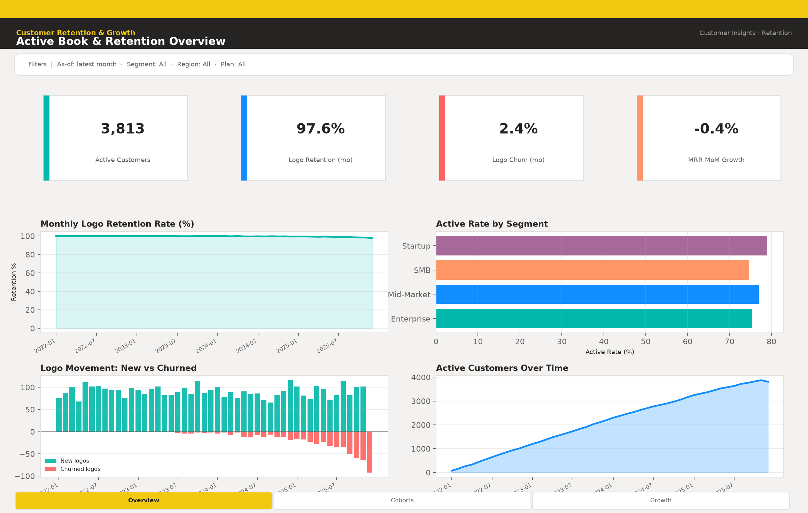
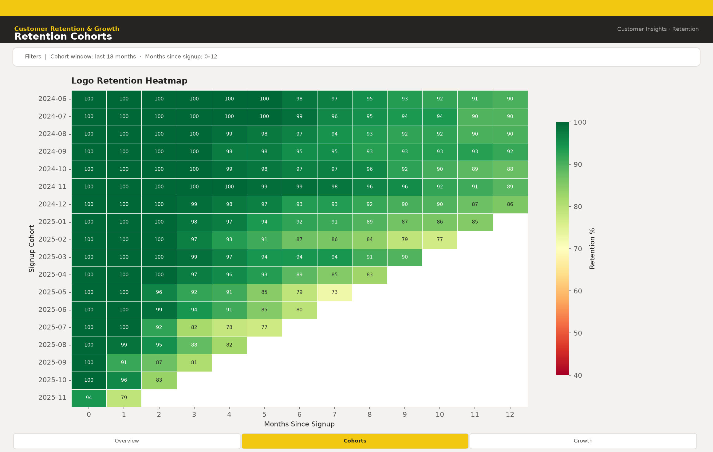
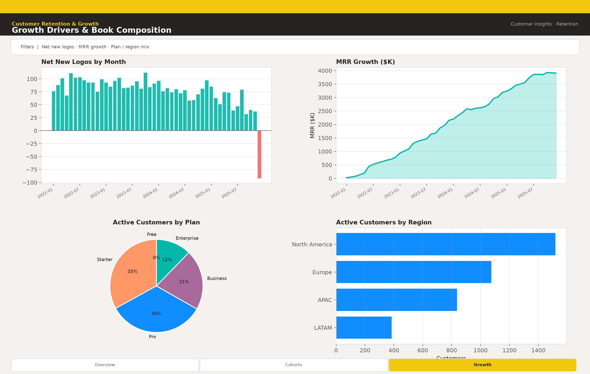
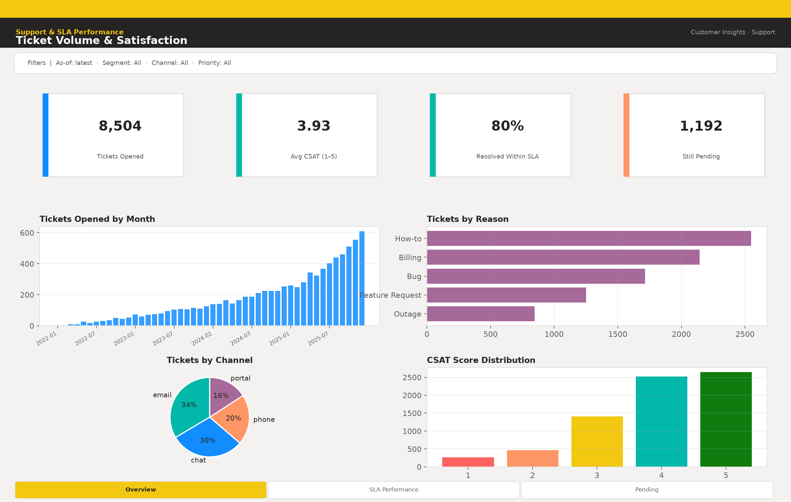
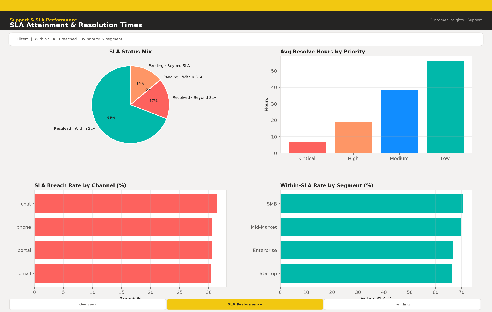
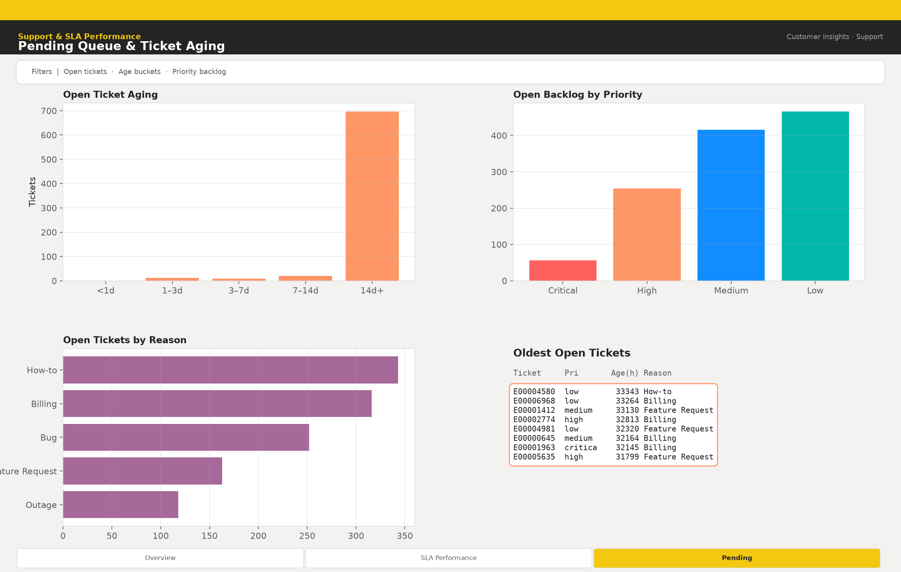

# Customer Insights BI

Customer analytics stack for SaaS operations: source extracts → curated marts → churn model → **Power BI** reports (PBIP project + semantic model / DAX; screenshots secondary).

**Repo:** https://github.com/user-JB007/customer-insights-bi

---

## Power BI Reports

**Primary BI deliverable: Power BI Project (PBIP)** under [`powerbi/`](powerbi/) — opens in Power BI Desktop. Screenshots below are secondary GitHub previews (not the workbook).

| Report | Open this |
|--------|-----------|
| **Customer Retention & Growth** | [`powerbi/Customer_Retention_Growth.pbip`](powerbi/Customer_Retention_Growth.pbip) |
| **Support & SLA Performance** | [`powerbi/Support_SLA_Performance.pbip`](powerbi/Support_SLA_Performance.pbip) |

Shared semantic model: [`powerbi/CustomerInsights.SemanticModel/`](powerbi/CustomerInsights.SemanticModel/) (TMSL `model.bim` + measures). Mart CSVs for refresh: `powerbi/data/` (and `data/marts/`).

**Open in Power BI Desktop:** see exact steps in [`powerbi/README.md`](powerbi/README.md). After refresh, File → Save As → `.pbix` if you need a single-file workbook.

**Rebuild project from marts:**

```bash
python scripts/build_powerbi_project.py
```

### Report 1 — Customer Retention & Growth (preview)
Retention, cohorts, active customers, and growth.

| Page | Preview |
|------|---------|
| Overview |  |
| Cohorts |  |
| Growth |  |

### Report 2 — Support & SLA Performance (preview)
Satisfaction, within SLA / breached / pending, resolution times and aging. Parameter measure: **Aging Threshold Hours**.

| Page | Preview |
|------|---------|
| Overview |  |
| SLA Performance |  |
| Pending |  |

---

## Problem

SaaS operators need a single customer view: who is growing, who is leaving, and how support/SLA performance affects the book. This project runs an end-to-end path from raw events → curated marts → churn scoring → executive visuals that can be rebuilt locally from committed mart CSVs (no cloud credentials required).

## Architecture

```
Raw CSV (customers, transactions, support)
JSONPlaceholder API (users / posts / comments)  ──► engagement_events mart
        │
        ▼
 Curated marts  ←── sql/marts/*.sql (Snowflake)  +  Python parity builder
        │
        ├──► Churn model (Gradient Boosting) → artifacts/model/
        ├──► Power BI report screenshots → powerbi/screenshots/
        └──► HTTP sinks: local FastAPI /ingest + JSONPlaceholder /posts
```

See [docs/architecture.md](docs/architecture.md) and [docs/bi_tool_mapping.md](docs/bi_tool_mapping.md).

### Sources

| Source | Type | Notes |
|--------|------|-------|
| `data/raw/*.csv` | File | Default offline path (`--source file`) |
| [JSONPlaceholder](https://jsonplaceholder.typicode.com/) | HTTP GET | Primary API source — `/users`, `/posts`, `/comments` as engagement inputs → `data/marts/engagement_events.csv`. Config: `config/pipeline.yaml` `api_source` / `API_SOURCE_BASE_URL` |

### Sinks

| Sink | Type | Notes |
|------|------|-------|
| Local landing API | HTTP POST | `src/sinks/http_sink_server.py` — `POST /ingest` → `data/landing/`; `SINK_API_URL` default `http://127.0.0.1:8089/ingest` |
| [JSONPlaceholder](https://jsonplaceholder.typicode.com/posts) | HTTP POST | Alternate external sink (`EXTERNAL_SINK_URL`) |
| File fallback | Local JSON | If local sink is down, KPI snapshot is written under `data/landing/` |

## Deliverables

| Deliverable | Description |
|-------------|-------------|
| **Source data** | 5,000 customers, multi-year transactions & support tickets with SLA clocks and CSAT |
| **SQL marts** | Customer 360, retention, revenue cohorts, MRR movement, segment, product, support/SLA |
| **Churn ML** | Trained Gradient Boosting model, ROC-AUC / precision / recall, feature importance, holdout preds |
| **Power BI reports** | 2 multi-page reports (Retention & Growth · Support & SLA) with PNGs |
| **BI docs** | Semantic model + DAX + page briefs — recreate in Power BI Desktop from mart CSVs |
| **One command** | `python run_pipeline.py` regenerates everything |

## Quick start

```bash
git clone https://github.com/user-JB007/customer-insights-bi.git
cd customer-insights-bi

python -m venv .venv
source .venv/bin/activate   # Windows: .venv\Scripts\activate
pip install -r requirements.txt

python run_pipeline.py
```

API source + sink stages:

```bash
# Pull engagement events from JSONPlaceholder
python -m src.integrations.api_source

# Full run with API source and KPI sink
python run_pipeline.py --source both --sink api

# Local sink receiver
uvicorn src.sinks.http_sink_server:app --host 127.0.0.1 --port 8089

# Push KPI snapshot only
python -m src.integrations.api_sink
```

Offline: use `--source file` (default) so existing raw CSV → marts continues when the network is unavailable. If a prior `engagement_events` mart exists, the API source reuses it on failure.

Outputs:

- `data/raw/` — source tables
- `data/marts/` — curated CSV + Parquet marts
- `data/processed/churn_features.*` — ML feature table
- `artifacts/model/` — `churn_model.joblib`, `metrics.json`, `EVALUATION.md`
- `powerbi/screenshots/` — Power BI report PNGs (2 reports × 3 pages)

### Run steps individually

```bash
python src/data/generate_source_data.py --n-customers 5000
python src/data/build_marts.py
python src/models/train_churn.py
python src/viz/generate_powerbi_pages.py
```

## Project layout

```
customer-insights-bi/
├── README.md
├── requirements.txt
├── run_pipeline.py
├── artifacts/model/          # trained model + metrics
├── data/
│   ├── raw/                  # source extracts
│   ├── processed/            # ML features
│   └── marts/                # curated analytics tables
├── docs/
│   ├── architecture.md
│   └── bi_tool_mapping.md
├── notebooks/
│   └── churn_model_walkthrough.ipynb
├── powerbi/                  # 2 reports: screenshots, model, DAX, page briefs
├── reports/powerbi/screenshots/  # mirror of Power BI PNGs
├── sql/marts/                # Snowflake-flavored DDL + views
├── config/pipeline.yaml      # API source/sink URLs
├── .env.example
└── src/
    ├── data/                 # generate + build marts
    ├── integrations/         # JSONPlaceholder source + HTTP sink client
    ├── sinks/http_sink_server.py
    ├── models/               # train churn classifier
    └── viz/                  # Power BI page generator
```

## Model notes

- Algorithm: `GradientBoostingClassifier` (scikit-learn) with scaled numerics + one-hot categoricals
- Target: `is_churned`
- Features: tenure, usage, NPS, support tickets, payment failures, health score, plan/segment/region/channel, revenue aggregates
- Evaluation: stratified holdout + 5-fold CV ROC-AUC; full write-up in `artifacts/model/EVALUATION.md`

This is a trained model on source data designed with identifiable signal — not a stub.

## SQL / warehouse

Deploy `sql/marts/00_setup.sql` through `06_product_revenue.sql` to Snowflake. Local Parquet/CSV marts match the same grains for offline Power BI. Optional broader tool notes: [docs/bi_tool_mapping.md](docs/bi_tool_mapping.md).

## License

MIT — no PII in committed extracts.
