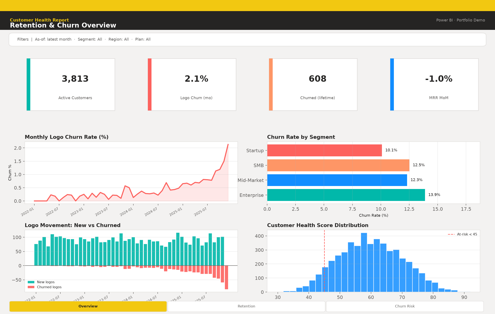
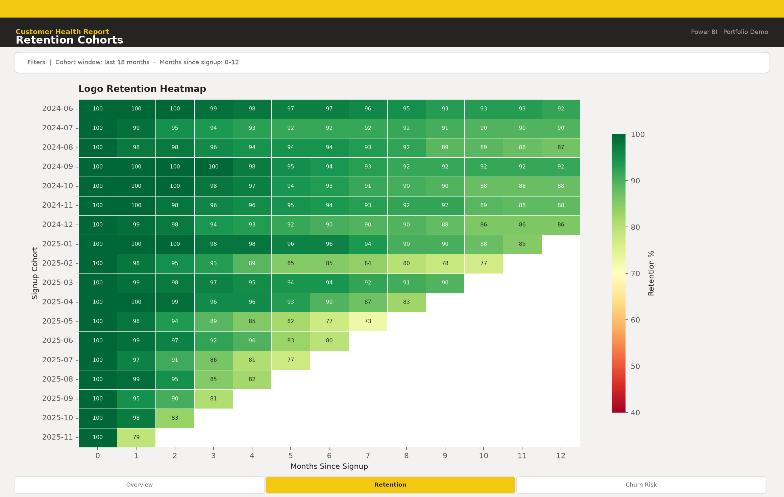
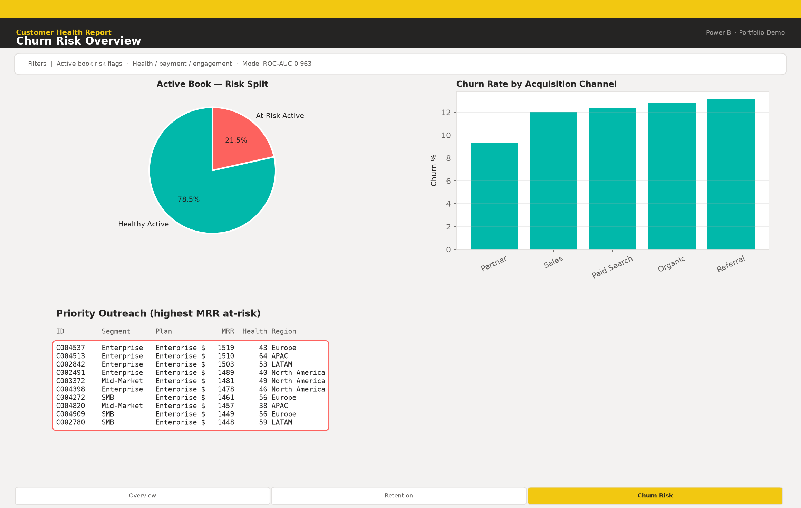
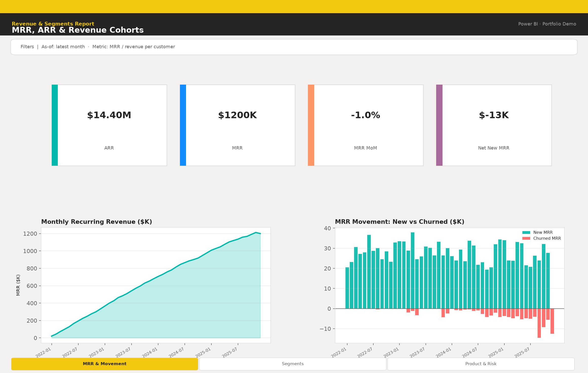
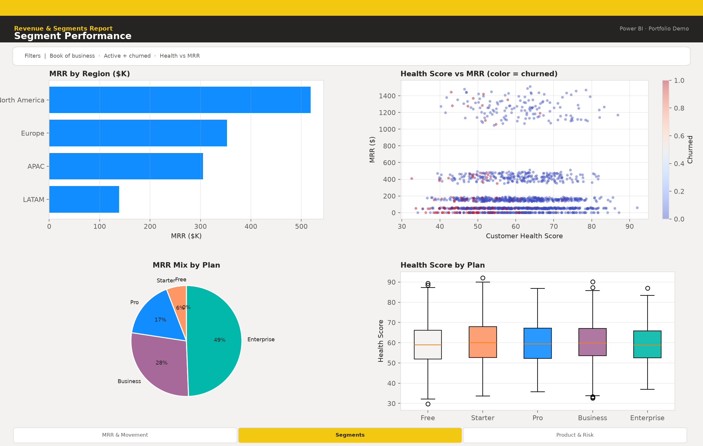
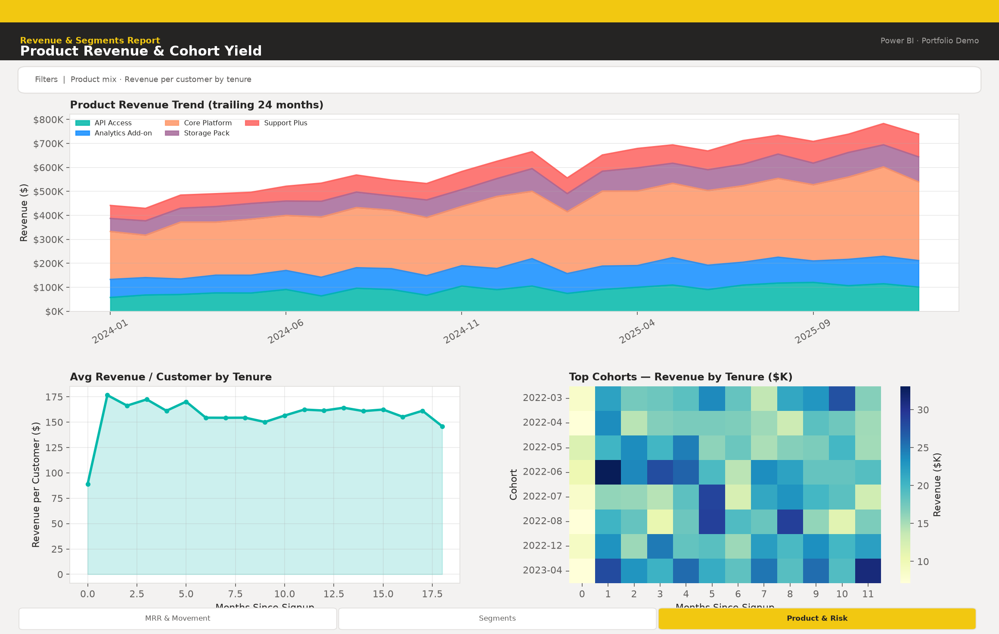

# Customer Insights BI

**Hire-ready data engineering + analytics portfolio project** — synthetic SaaS customer data, Snowflake-flavored SQL marts, a real churn ML model, and **Power BI** executive reports (screenshots + semantic model / DAX).

📁 **Repo:** https://github.com/user-JB007/customer-insights-bi

---

## Power BI Reports

**Primary BI tool: Power BI.** View two multi-page reports on GitHub **without Power BI Desktop**. Pipeline marts + churn ML + screenshots are all in-repo.

### Report A — Customer Health
Retention, cohorts, and churn risk overview.

| Page | Preview |
|------|---------|
| Overview |  |
| Retention |  |
| Churn Risk |  |

### Report B — Revenue & Segments
MRR/revenue, segment performance, product & cohort yield.

| Page | Preview |
|------|---------|
| MRR & Movement |  |
| Segments |  |
| Product & Cohorts |  |

**Desktop recreation** (star schema, DAX, page briefs): [`powerbi/README.md`](powerbi/README.md)

```bash
python src/viz/generate_powerbi_pages.py   # → powerbi/screenshots/ (+ mirror under reports/powerbi/)
```


## Problem

SaaS operators need a single customer view: who is growing, who is churning, and which cohorts pay back. This project demonstrates an end-to-end path from raw events → curated marts → churn scoring → executive visuals that a hiring manager or client can clone and run locally (no cloud credentials).

## Architecture

```
Raw CSV (customers, transactions, support)
        │
        ▼
 Curated marts  ←── sql/marts/*.sql (Snowflake)  +  Python parity builder
        │
        ├──► Churn model (Gradient Boosting) → artifacts/model/
        └──► Power BI report screenshots → powerbi/screenshots/
                 └── semantic model + DAX for Desktop / Fabric recreation
```

See [docs/architecture.md](docs/architecture.md) and [docs/bi_tool_mapping.md](docs/bi_tool_mapping.md).

## Portfolio highlights

| Deliverable | What you get |
|-------------|--------------|
| **Synthetic data** | 5,000 customers, multi-year transactions & support events with realistic churn drivers |
| **SQL marts** | Customer 360, retention, revenue cohorts, MRR movement, segment & product marts |
| **Churn ML** | Trained Gradient Boosting model, ROC-AUC / precision / recall, feature importance, holdout preds |
| **Power BI reports** | 2 multi-page reports (Customer Health · Revenue & Segments) with polished PNGs |
| **BI docs** | Semantic model + DAX + page briefs — recreate in Power BI Desktop from mart CSVs |
| **One command** | `python run_pipeline.py` regenerates everything |

## Quick start

```bash
git clone https://github.com/user-JB007/customer-insights-bi.git
cd customer-insights-bi

python -m venv .venv
source .venv/bin/activate   # Windows: .venv\Scripts\activate
pip install -r requirements.txt

python run_pipeline.py
```

Outputs:

- `data/raw/` — synthetic source tables  
- `data/marts/` — curated CSV + Parquet marts  
- `data/processed/churn_features.*` — ML feature table  
- `artifacts/model/` — `churn_model.joblib`, `metrics.json`, `EVALUATION.md`  
- `powerbi/screenshots/` — Power BI report PNGs (2 reports × 3 pages)  

### Run steps individually

```bash
python src/data/generate_synthetic.py --n-customers 5000
python src/data/build_marts.py
python src/models/train_churn.py
python src/viz/generate_powerbi_pages.py
```

## Project layout

```
customer-insights-bi/
├── README.md
├── requirements.txt
├── run_pipeline.py
├── artifacts/model/          # trained model + metrics
├── data/
│   ├── raw/                  # synthetic sources
│   ├── processed/            # ML features
│   └── marts/                # curated analytics tables
├── docs/
│   ├── architecture.md
│   └── bi_tool_mapping.md
├── notebooks/
│   └── churn_model_walkthrough.ipynb
├── powerbi/                  # 2 reports: screenshots, model, DAX, page briefs
├── reports/powerbi/screenshots/  # mirror of Power BI PNGs
├── sql/marts/                # Snowflake-flavored DDL + views
└── src/
    ├── data/                 # generate + build marts
    ├── models/               # train churn classifier
    └── viz/                  # Power BI page generator
```

## Model notes

- Algorithm: `GradientBoostingClassifier` (scikit-learn) with scaled numerics + one-hot categoricals  
- Target: `is_churned`  
- Features: tenure, usage, NPS, support tickets, payment failures, health score, plan/segment/region/channel, revenue aggregates  
- Evaluation: stratified holdout + 5-fold CV ROC-AUC; full write-up in `artifacts/model/EVALUATION.md`  

This is a **real trained model** on synthetic data designed with identifiable signal — not a stub.

## SQL / warehouse

Deploy `sql/marts/00_setup.sql` through `06_product_revenue.sql` to Snowflake. Local Parquet/CSV marts match the same grains for offline Power BI. Optional broader tool notes: [docs/bi_tool_mapping.md](docs/bi_tool_mapping.md).

## License

MIT — use freely in portfolios and client demos. Data is synthetic; no PII.
