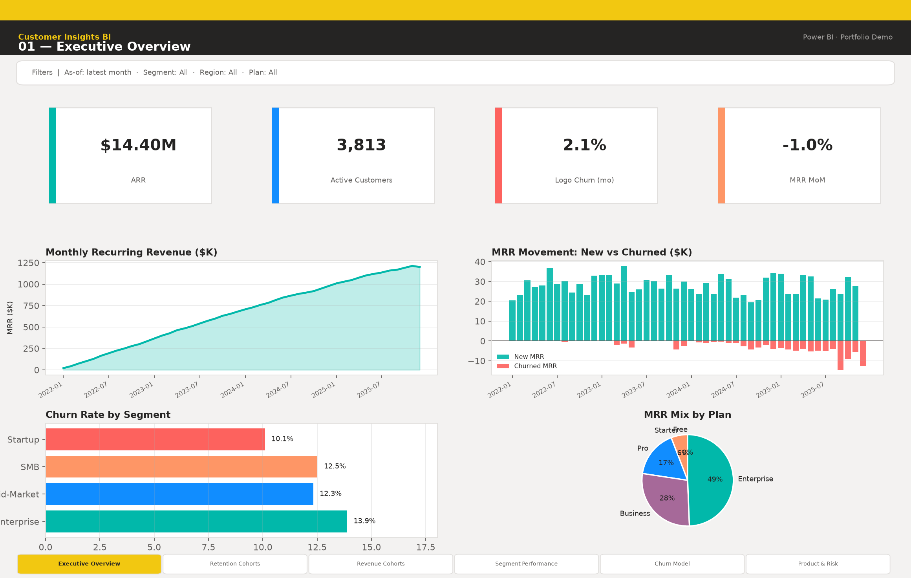
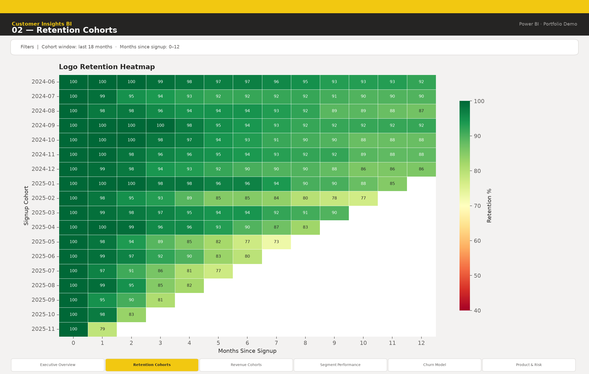
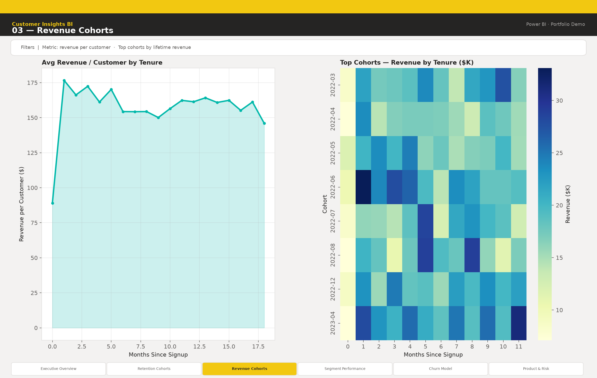
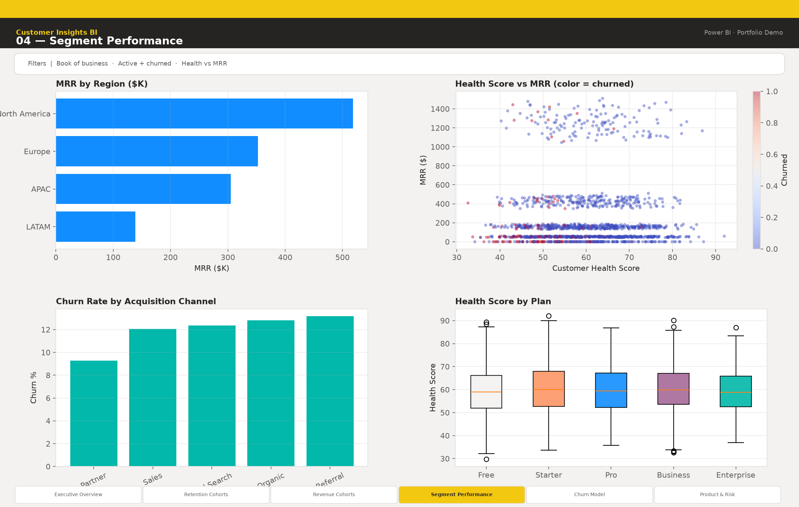
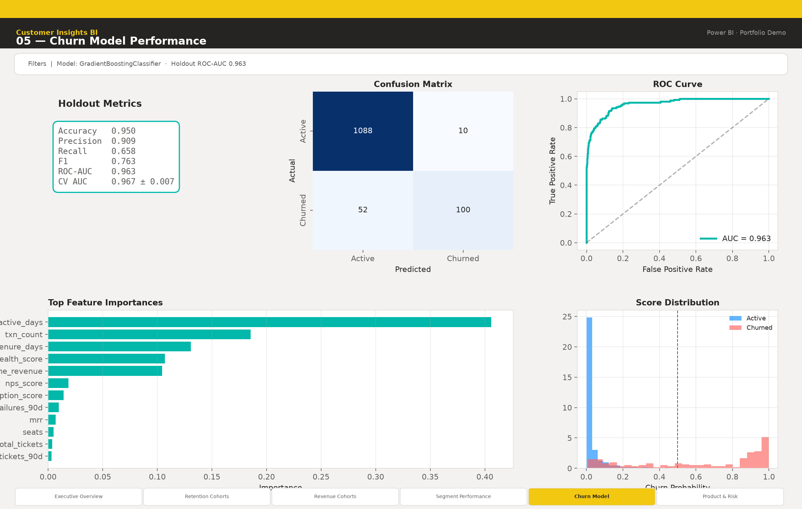
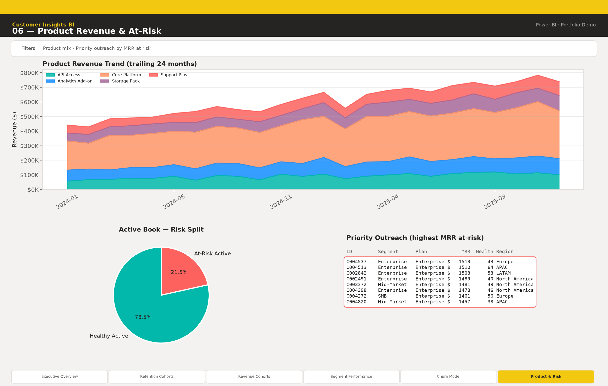

# Customer Insights BI

**Hire-ready data engineering + analytics portfolio project** — synthetic SaaS customer data, Snowflake-flavored SQL marts, a real churn ML model, and executive dashboard screenshots ready for Power BI / Tableau / Fabric / Databricks SQL.

📁 **Repo:** https://github.com/user-JB007/customer-insights-bi

---

## Power BI Reports

View executive dashboards on GitHub **without Power BI Desktop**. Pipeline marts + churn ML + BI screenshots are all in-repo.

| Page | Preview |
|------|---------|
| Executive Overview |  |
| Retention Cohorts |  |
| Revenue Cohorts |  |
| Segment Performance |  |
| Churn Model |  |
| Product & Risk |  |

Classic portfolio screenshots (same story, alternate chrome) remain under [`reports/screenshots/`](reports/screenshots/).  
**Desktop recreation** (star schema, DAX, page briefs): [`powerbi/README.md`](powerbi/README.md)

```bash
python src/viz/generate_powerbi_pages.py   # Power BI–styled pages → reports/powerbi/screenshots/
python src/viz/generate_dashboards.py      # classic pages → reports/screenshots/
```


## Problem

SaaS operators need a single customer view: who is growing, who is churning, and which cohorts pay back. This project demonstrates an end-to-end path from raw events → curated marts → churn scoring → executive visuals that a hiring manager or client can clone and run locally (no cloud credentials).

## Architecture

```
Raw CSV (customers, transactions, support)
        │
        ▼
 Curated marts  ←── sql/marts/*.sql (Snowflake)  +  Python parity builder
        │
        ├──► Churn model (Gradient Boosting) → artifacts/model/
        └──► Executive PNG dashboards → reports/screenshots/
                 └── documented mapping to Power BI / Tableau / Fabric / Databricks SQL
```

See [docs/architecture.md](docs/architecture.md) and [docs/bi_tool_mapping.md](docs/bi_tool_mapping.md).

## Portfolio highlights

| Deliverable | What you get |
|-------------|--------------|
| **Synthetic data** | 5,000 customers, multi-year transactions & support events with realistic churn drivers |
| **SQL marts** | Customer 360, retention, revenue cohorts, MRR movement, segment & product marts |
| **Churn ML** | Trained Gradient Boosting model, ROC-AUC / precision / recall, feature importance, holdout preds |
| **Dashboards** | 6 labeled executive-style PNG screenshots + generation script |
| **BI docs** | How to wire marts into Power BI, Tableau, Fabric, Databricks SQL — no live cloud required |
| **One command** | `python run_pipeline.py` regenerates everything |

## Quick start

```bash
git clone https://github.com/user-JB007/customer-insights-bi.git
cd customer-insights-bi

python -m venv .venv
source .venv/bin/activate   # Windows: .venv\Scripts\activate
pip install -r requirements.txt

python run_pipeline.py
```

Outputs:

- `data/raw/` — synthetic source tables  
- `data/marts/` — curated CSV + Parquet marts  
- `data/processed/churn_features.*` — ML feature table  
- `artifacts/model/` — `churn_model.joblib`, `metrics.json`, `EVALUATION.md`  
- `reports/screenshots/` — six portfolio PNGs  

### Run steps individually

```bash
python src/data/generate_synthetic.py --n-customers 5000
python src/data/build_marts.py
python src/models/train_churn.py
python src/viz/generate_dashboards.py
```

## Dashboard screenshots

| # | File | Description |
|---|------|-------------|
| 01 | `reports/screenshots/01_executive_overview.png` | ARR / customers / churn KPIs + MRR trend |
| 02 | `reports/screenshots/02_retention_heatmap.png` | Logo retention cohort heatmap |
| 03 | `reports/screenshots/03_revenue_cohorts.png` | Revenue per customer by tenure |
| 04 | `reports/screenshots/04_segment_performance.png` | Region, channel, plan performance |
| 05 | `reports/screenshots/05_churn_model_performance.png` | ROC, confusion matrix, importances |
| 06 | `reports/screenshots/06_product_and_risk.png` | Product mix + at-risk outreach list |

## Project layout

```
customer-insights-bi/
├── README.md
├── requirements.txt
├── run_pipeline.py
├── artifacts/model/          # trained model + metrics
├── data/
│   ├── raw/                  # synthetic sources
│   ├── processed/            # ML features
│   └── marts/                # curated analytics tables
├── docs/
│   ├── architecture.md
│   └── bi_tool_mapping.md
├── notebooks/
│   └── churn_model_walkthrough.ipynb
├── powerbi/                  # semantic model, DAX, page briefs
├── reports/screenshots/      # classic executive PNGs
├── reports/powerbi/screenshots/  # Power BI–chrome PNGs (README embeds)
├── sql/marts/                # Snowflake-flavored DDL + views
└── src/
    ├── data/                 # generate + build marts
    ├── models/               # train churn classifier
    └── viz/                  # dashboard + Power BI page generators
```

## Model notes

- Algorithm: `GradientBoostingClassifier` (scikit-learn) with scaled numerics + one-hot categoricals  
- Target: `is_churned`  
- Features: tenure, usage, NPS, support tickets, payment failures, health score, plan/segment/region/channel, revenue aggregates  
- Evaluation: stratified holdout + 5-fold CV ROC-AUC; full write-up in `artifacts/model/EVALUATION.md`  

This is a **real trained model** on synthetic data designed with identifiable signal — not a stub.

## SQL / warehouse

Deploy `sql/marts/00_setup.sql` through `06_product_revenue.sql` to Snowflake (or adapt per [docs/bi_tool_mapping.md](docs/bi_tool_mapping.md)). Local Parquet/CSV marts match the same grains for offline BI.

## License

MIT — use freely in portfolios and client demos. Data is synthetic; no PII.
